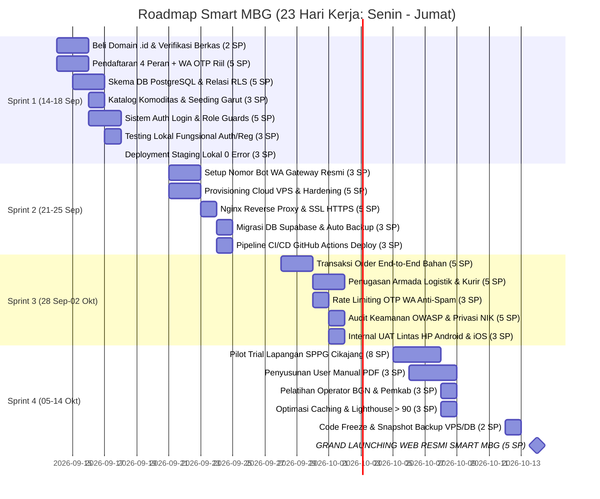

# Roadmap & Jadwal Pengerjaan Smart MBG (23 Hari Kerja Efektif)
## Target Periode: 14 September 2026 – 14 Oktober 2026 (Senin – Jumat, Sabtu & Minggu Libur)

Dokumen ini memuat perencanaan kerja komprehensif, terukur, dan terstandarisasi Scrum/Agile dengan **perhitungan hari kerja efektif (Senin s/d Jumat)**. Seluruh tanggal mulai (*Start Date*) dan tenggat selesai (*Due Date*) dijadwalkan murni pada hari kerja produktif tanpa membebankan pekerjaan pada akhir pekan (Sabtu & Minggu).

---

## 1. Rangkuman Eksekutif

| Parameter | Keterangan |
| :--- | :--- |
| **Model Kerja** | **Senin – Jumat (5 Hari Kerja per Pekan)** |
| **Hari Libur** | **Sabtu & Minggu (Non-Working Days / Libur)** |
| **Total Hari Kerja Efektif** | **23 Hari Kerja** (14 Sep – 14 Okt 2026) |
| **Rentang Waktu Kalender** | **31 Hari Kalender** (Senin, 14 Sep – Rabu, 14 Okt 2026) |
| **Tanggal Grand Launching** | **Rabu, 14 Oktober 2026** |
| **Total Beban Kerja (Story Points)** | **90 Story Points** (Rata-rata 22.5 SP / Sprint) |
| **Struktur Tiket** | 5 Epics, 22 User Stories (Model Standar), 55 Sub-tasks Teknis |
| **Dashboard Live** | [Google Sheets Roadmap & Gantt Chart](https://docs.google.com/spreadsheets/d/1MGiWhVSjRf3JHWibTkw2WQTh5n_IpEB848m3lROTsuA/edit) |
| **File Jira Siap Import** | [`docs/jira-import-smart-mbg.csv`](file:///G:/WORK/picing/frontend/smart-mbg-local/docs/jira-import-smart-mbg.csv) |

---

## 2. Struktur 4 Sprint Kerja (Hari Kerja Efektif)

| Sprint | Rentang Tanggal | Hari Kerja | Total SP | Target Milestone Utama |
| :--- | :---: | :---: | :---: | :--- |
| **Sprint 1** | **14 Sep – 18 Sep 2026** | **5 Hari** (Sen – Jum) | **26 SP** | Formulir 4 Peran + OTP WA Riil, DB PostgreSQL, Domain .ID & Staging Lokal Siap. |
| *Weekend 1* | *19 Sep – 20 Sep 2026* | *Libur (2 Hari)* | *-* | *Libur Akhir Pekan* |
| **Sprint 2** | **21 Sep – 25 Sep 2026** | **5 Hari** (Sen – Jum) | **19 SP** | Cloud VPS Ubuntu 24.04, Nginx SSL HTTPS, Auto-Backup DB & Bot WA Gateway Resmi. |
| *Weekend 2* | *26 Sep – 27 Sep 2026* | *Libur (2 Hari)* | *-* | *Libur Akhir Pekan* |
| **Sprint 3** | **28 Sep – 02 Okt 2026** | **5 Hari** (Sen – Jum) | **21 SP** | Transaksi Bahan Baku End-to-End, Armada Logistik, Rate Limiting OTP & Security QA. |
| *Weekend 3* | *03 Okt – 04 Okt 2026* | *Libur (2 Hari)* | *-* | *Libur Akhir Pekan* |
| **Sprint 4** | **05 Okt – 14 Okt 2026** | **8 Hari** (Sen – Rab) | **24 SP** | Pilot SPPG Cikajang, User Manual PDF, Training Operator, Code Freeze & Grand Launching! |
| *TOTAL* | | **23 Hari Kerja** | **90 SP** | **GRAND LAUNCHING: RABU, 14 OKTOBER 2026** |

---

## 3. Diagram Gantt Timeline (Hari Kerja Efektif)

---

## 4. Jadwal Rinci Hari Kerja (Senin – Jumat)

### 📌 SPRINT 1: Auth & Register, Skema DB, Testing & Staging (14 – 18 Sep 2026) — 5 Hari Kerja | 26 SP
| Kode | Aktivitas / User Story | SP | Hari Kerja | PIC / Role | Deliverables Utama |
| :--- | :--- | :---: | :---: | :--- | :--- |
| **SMBG-10** | Pengadaan Domain Resmi .ID & Setup DNS | **2 SP** | Sen – Rab (14–16 Sep) | Project Manager | Domain `smartmbg.id` aktif di Cloudflare DNS |
| **SMBG-6** | Pendaftaran 4 Peran + WhatsApp OTP Riil | **5 SP** | Sen – Rab (14–16 Sep) | Frontend Dev | Registrasi Warga, Mitra, Supplier, Kurir dengan OTP WA Fonnte |
| **SMBG-7** | Skema Relasi PostgreSQL Supabase & RLS | **5 SP** | Sel – Kam (15–17 Sep) | Database Eng | Skema tabel lengkap, indeks query & policy RLS aman |
| **SMBG-8** | Katalog Komoditas Pangan Pokok Garut | **3 SP** | Rab – Kam (16–17 Sep) | Data Engineer | Master data pangan lokal & script seeder otomatis |
| **SMBG-9** | Sistem Auth Login Multi-Role & Sesi | **5 SP** | Rab – Jum (16–18 Sep) | Fullstack Dev | Login multi-role, RBAC route guards & auto-redirect dasbor |
| **SMBG-27** | Testing Lokal Fungsional Auth & Register | **3 SP** | Kam – Jum (17–18 Sep) | QA Tester | Uji kasus sukses & skenario gagal OTP di staging lokal |
| **SMBG-28** | Deployment Server Staging Lokal & Build Test | **3 SP** | Jumat (18 Sep) | DevOps Eng | Verifikasi `npm run build` & typecheck 0 error |
| *M-1* | *Milestone 1: Staging Server Lokal Siap Bebas Error* | *-* | *Jumat, 18 Sep 2026* | *Tech Lead* | *Baseline Staging Rampung sebelum Weekend* |

---

### 📌 SPRINT 2: Cloud VPS, SSL HTTPS, Auto Backup & Bot WA (21 – 25 Sep 2026) — 5 Hari Kerja | 19 SP
| Kode | Aktivitas / User Story | SP | Hari Kerja | PIC / Role | Deliverables Utama |
| :--- | :--- | :---: | :---: | :--- | :--- |
| **SMBG-14** | Setup Nomor Khusus Bot WA Gateway Resmi | **3 SP** | Sen – Rab (21–23 Sep) | Product Owner | Nomor WhatsApp Business resmi sistem aktif 24 jam |
| **SMBG-11** | Provisioning Cloud VPS Ubuntu 24.04 LTS | **5 SP** | Sen – Rab (21–23 Sep) | DevOps Eng | Server VPS 4 vCPU 8GB RAM, SSH Key, UFW firewall aktif |
| **SMBG-12** | Nginx Reverse Proxy & SSL TLS Let's Encrypt | **5 SP** | Rab – Kam (23–24 Sep) | DevOps Eng | Web server HTTPS terenkripsi SSL Grade A & A-Record domain |
| **SMBG-13** | Migrasi DB Supabase Cloud & Auto Backup Cron | **3 SP** | Kam – Jum (24–25 Sep) | Database Eng | DB Supabase produksi aktif + cron daily backup pg_dump |
| **SMBG-15** | Pipeline CI/CD GitHub Actions Auto-Deploy | **3 SP** | Kam – Jum (24–25 Sep) | DevOps Eng | Auto-deploy ke VPS setiap ada push di branch `main` |
| *M-2* | *Milestone 2: Server Cloud Production HTTPS Aktif* | *-* | *Jumat, 25 Sep 2026* | *DevOps Lead* | *Sistem Online di Cloud sebelum Weekend* |

---

### 📌 SPRINT 3: Integrasi Rantai Pasok & Security QA (28 Sep – 02 Okt 2026) — 5 Hari Kerja | 21 SP
| Kode | Aktivitas / User Story | SP | Hari Kerja | PIC / Role | Deliverables Utama |
| :--- | :--- | :---: | :---: | :--- | :--- |
| **SMBG-16** | Integrasi Pemesanan Bahan Baku SPPG | **5 SP** | Sen – Rab (28–30 Sep) | Fullstack Dev | Checkout bahan baku dapur -> WA notifikasi ke Supplier |
| **SMBG-17** | Penugasan Armada Logistik & Pelacakan | **5 SP** | Rab – Jum (30 Sep–02 Okt) | Fullstack Dev | Penugasan kurir, update rute perjalanan & bukti serah terima |
| **SMBG-18** | Proteksi Rate Limiting OTP WA Anti-Spam | **3 SP** | Rab – Kam (30 Sep–01 Okt) | Backend Dev | Batasan request OTP (3x / 5 menit) & anti-brute force |
| **SMBG-19** | Audit Keamanan OWASP Top 10 & Privasi NIK | **5 SP** | Kam – Jum (01–02 Okt) | Security Analyst | Pentest injeksi formulir web & enkripsi/masking data NIK |
| **SMBG-20** | Internal UAT Lintas HP Android & iOS | **3 SP** | Kam – Jum (01–02 Okt) | QA Tester | Uji antarmuka mobile responsive & skenario transaksi terpadu |
| *M-3* | *Milestone 3: Release Candidate 1.0 (Zero Blocker)* | *-* | *Jumat, 02 Okt 2026* | *Tech Lead* | *Fitur Inti Selesai 100% sebelum Weekend* |

---

### 📌 SPRINT 4: Pilot Lapangan, Pelatihan & Grand Launching (05 – 14 Okt 2026) — 8 Hari Kerja | 24 SP
| Kode | Aktivitas / User Story | SP | Hari Kerja | PIC / Role | Deliverables Utama |
| :--- | :--- | :---: | :---: | :--- | :--- |
| **SMBG-21** | Pilot Trial Lapangan Nyata SPPG Cikajang | **8 SP** | Sen – Kam (05–08 Okt) | Project Manager | Simulasi transaksi riil 1 Dapur SPPG & 1 Supplier lokal Garut |
| **SMBG-22** | Penyusunan User Manual PDF Bergambar | **3 SP** | Sel – Jum (06–09 Okt) | Technical Writer | Modul petunjuk operasional 4 aktor siap unduh |
| **SMBG-23** | Pelatihan Operator BGN & Pemkab Garut | **3 SP** | Kam – Jum (08–09 Okt) | Project Manager | Workshop demo daring & serah terima akun admin |
| **SMBG-24** | Optimasi Caching & Skor Lighthouse > 90 | **3 SP** | Kam – Jum (08–09 Okt) | Frontend Dev | Kompresi WebP, caching Brotli Nginx (Lighthouse > 90) |
| *Weekend* | *10 Okt – 11 Okt 2026* | *Libur (2 Hari)* | *-* | *Libur Akhir Pekan sebelum Minggu Peluncuran* |
| **SMBG-25** | Code Freeze & Snapshot Backup VPS/DB | **2 SP** | Sen – Sel (12–13 Okt) | DevOps Lead | Kunci branch kode 48 jam & full snapshot recovery point |
| **SMBG-26** | 🚀 GRAND LAUNCHING WEB RESMI SMART MBG | **5 SP** | **Rabu, 14 Okt 2026** | **All Team** | **Pelepasan domain publik, siaran pers & 24 jam monitoring** |
