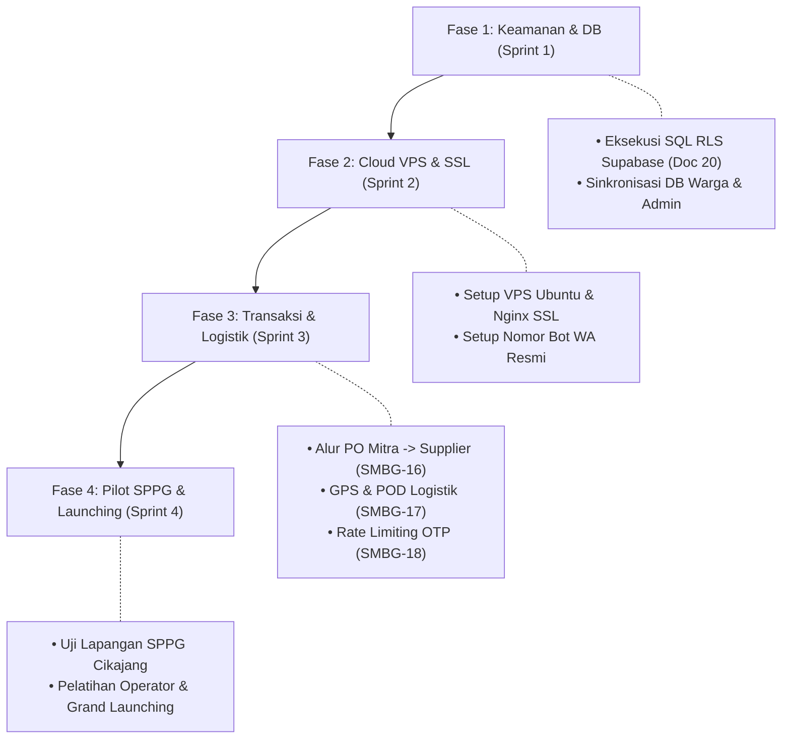

# Analisis Masalah, Riwayat Perbaikan, dan Keterbatasan per Role — Smart MBG

Dokumen ini memetakan seluruh masalah yang pernah terjadi (dan sudah diperbaiki) serta masalah/keterbatasan aktif (*open issues / pending gaps*) yang masih ada pada masing-masing peran (*role*) di ekosistem Smart MBG. Dokumen ini berfungsi sebagai acuan audit kualitas dan prioritas perbaikan tim pengembang.

- **Nomor Dokumen:** 21
- **Tanggal Pembuatan:** Selasa, 15 September 2026
- **Lokasi Proyek:** `G:\WORK\picing\frontend\smart-mbg-local`
- **Status Dokumen:** Dokumen Audit & Pemetaan Masalah Sistem

---

## 1. Matriks Ringkasan Status per Role

| Peran (Role) | Ruang Lingkup Halaman | Masalah Kritis Selesai | Masalah / Keterbatasan Aktif | Tingkat Kesiapan (*Readiness*) |
| :--- | :--- | :---: | :---: | :---: |
| **Warga / Penerima** | `/marketplace`, `/warga/*` | 3 | 4 | **75% (Siap Uji UI/UX)** |
| **Mitra / SPPG** | `/mitra/*` | 3 | 3 | **85% (Alur PO Cloud Terintegrasi)** |
| **Supplier** | `/supplier/*` | 3 | 3 | **80% (Notifikasi Pesanan Realtime Aktif)** |
| **Logistik** | `/logistik/*` | 1 | 4 | **60% (Armada Siap, GPS & Bukti Kirim Pending)** |
| **Admin Panel** | `/admin/*` | 4 | 2 | **90% (RLS Bebas, Realtime Supabase Aktif)** |
| **Global / Infra** | Auth, Gateway WA, Database | 4 | 2 | **85% (Realtime DB Siap, Staging Pending)** |

---

## 2. Role 1: Warga / Penerima MBG
*Rute Akses: `/marketplace`, `/warga/beranda`, `/warga/keranjang`, `/warga/checkout`, `/warga/pesanan`, `/warga/profil`*

### A. Masalah yang Sudah Diperbaiki (Resolved)
1. **Pemisahan Navigasi yang Membingungkan:** Sebelumnya terdapat dua halaman belanja paralel (`/warga/belanja` dan `/marketplace`). Saat ini belanja publik dipusatkan penuh di `/marketplace`, sedangkan `/warga/beranda` difungsikan sebagai ringkasan akun.
2. **Perbaikan Celah Login & Verifikasi OTP:** Pengguna kini wajib memasukkan password yang valid dan menyelesaikan verifikasi OTP WhatsApp via Fonnte sebelum akun aktif.
3. **Penyelarasan Navbar Warga:** Penambahan menu keranjang belanja, status pesanan aktif, dan profil akun yang responsif pada bilah navigasi saat login sebagai warga.

### B. Keterbatasan & Masalah Aktif Saat Ini (Pending Gaps)
1. **Penyimpanan Pesanan Terisolasi di Browser (`localStorage`):**
   * *Akar Masalah:* Pesanan warga disimpan menggunakan modul `warga-store.js` ke `warga_orders_{email}` di browser lokal.
   * *Dampak:* Jika warga berganti perangkat atau menghapus data browser, riwayat pesanan dan status pelacakan tidak akan terbaca di perangkat baru.
   * *Solusi Diperlukan:* Migrasi penyimpanan pesanan warga langsung ke tabel `public.orders` di Supabase.
2. **Metode Pembayaran Masih Simulasi:**
   * *Akar Masalah:* Opsi pembayaran QRIS, Transfer Bank, dan COD menyelesaikan status order secara instan di sisi *client-side*.
   * *Dampak:* Belum ada integrasi *Payment Gateway* riil (Midtrans/Xendit) untuk memverifikasi dana masuk secara otomatis.
3. **Validasi NIK Belum Terintegrasi Dukcapil:**
   * *Akar Masalah:* NIK 16 digit pada form pendaftaran hanya diverifikasi dari segi panjang karakter (16 digit numerik).
   * *Dampak:* Tidak dapat memvalidasi apakah NIK tersebut valid terdaftar di Dinas Dukcapil atau terdaftar sebagai penerima manfaat resmi MBG Garut.
4. **Dualisme Halaman Legacy Penerima:**
   * *Akar Masalah:* Masih ada sisa rute lama `/penerima/dashboard`, `/penerima/daftar`, dan `/penerima/rating` di `App.jsx`.
   * *Solusi Diperlukan:* Melakukan *cleanup* kode dan menghapus rute legacy tersebut agar dialihkan seluruhnya ke `/warga/*`.

---

## 3. Role 2: Mitra / SPPG (Dapur Sehat Satuan Pelayanan)
*Rute Akses: `/mitra/dashboard`, `/mitra/cart`, `/mitra/orders`, `/mitra/kebutuhan`, `/mitra/nutrition`, `/mitra/reports`*

### A. Masalah yang Sudah Diperbaiki (Resolved)
1. **Ralat Alur Redirect Login:** Sebelumnya diarahkan ke beranda publik; kini setelah login mitra langsung diarahkan ke `/mitra/dashboard`.
2. **Skema Identitas SPPG:** Penambahan field nama SPPG, kapasitas porsi harian, dan alamat operasional dapur yang tersimpan ke Supabase `user_profiles`.
3. **Integrasi Transaksi PO Bahan Baku End-to-End (SMBG-16):** Alur pemesanan bahan dari keranjang belanja Mitra (`MitraCart.jsx` -> `MitraCheckout.jsx`) kini tersimpan langsung ke tabel `orders` Supabase Cloud dengan nomor order resmi, status `pending`, dan otomatis muncul di layar Supplier secara realtime.

### B. Keterbatasan & Masalah Aktif Saat Ini (Pending Gaps)
1. **Kalkulator Gizi & Rekomendasi Menu Masih Statis:**
   * *Akar Masalah:* Modul `IngredientNutritionCalculator` dan menu harian masih mengandalkan formula perhitungan statis di frontend.
   * *Dampak:* Belum terhubung secara dinamis dengan alokasi kuota penerima per sekolah atau ketersediaan stok riil supplier lokal pada hari itu.
2. **Inkonsistensi Arah Desain UX Dashboard:**
   * *Akar Masalah:* Dokumen awal sempat merencanakan penghapusan `/mitra/dashboard` untuk dialihkan ke `/mitra/products`.
   * *Solusi Diperlukan:* Penetapan apakah menu ringkasan dasbor tetap dipertahankan sebagai pusat KPI dapur (disarankan dipertahankan).
3. **Rating Supplier Belum Agregat:**
   * *Akar Masalah:* Skor bintang dan ulasan yang dikirim mitra terhadap supplier baru tersimpan di memori browser lokal.
   * *Dampak:* Belum terbentuk skor agregat reputasi publik yang dapat dilihat oleh SPPG lain sebelum memilih supplier.

---

## 4. Role 3: Supplier Bahan Pangan
*Rute Akses: `/supplier/dashboard`, `/supplier/products`, `/supplier/orders`, `/supplier/income`, `/supplier/chat`*

### A. Masalah yang Sudah Diperbaiki (Resolved)
1. **Pembersihan URL Aset Gambar Rusak:** Seluruh tautan gambar produk pangan lokal yang tadinya merujuk ke domain `media.base44.com` telah diganti dengan aset Unsplash/lokal.
2. **Pendaftaran Komoditas Lokal Garut:** Form pendaftaran supplier sudah mencakup jenis komoditas (beras, sayur, daging, bumbu) dan verifikasi nomor WhatsApp pengurus.
3. **Notifikasi Pesanan Masuk Realtime dari Mitra (SMBG-16):** Halaman `/supplier/orders` telah tersambung langsung ke WebSocket Realtime Supabase (`orders`). Pesanan PO dari Dapur Mitra otomatis muncul dengan nominal harga dan data pemesan yang valid secara instan.

### B. Keterbatasan & Masalah Aktif Saat Ini (Pending Gaps)
1. **Stok Produk Belum Sinkron ke Marketplace & Admin:**
   * *Akar Masalah:* Saat supplier mengedit atau menambah stok di `/supplier/products`, perubahan baru tercatat pada tabel lokal supplier.
   * *Dampak:* Stok di katalog publik atau laporan monitoring Admin belum terpotong secara otomatis saat transaksi terjadi.
2. **Pemilihan Logistik Masih Mockup UI:**
   * *Akar Masalah:* Tombol "Pilih Logistik" pada daftar order yang siap dikirim belum mengikat kurir/driver tertentu di database.
   * *Dampak:* Belum memicu perpindahan status pesanan ke daftar tugas logistik.
3. **Obrolan Chat Admin Belum Persisten:**
   * *Akar Masalah:* Halaman `/supplier/chat` menggunakan komponen state React biasa (`ChatPanel`).
   * *Dampak:* Jika halaman di-*refresh*, riwayat percakapan dengan Admin akan hilang (belum terhubung ke tabel `chats`/`messages`).
4. **Laporan Pendapatan Belum Terkoneksi Rekening Bank:**
   * *Akar Masalah:* Modul pencairan dana omzet baru berupa visualisasi angka, belum ada integrasi *disbursement* otomatis ke rekening bank mitra supplier.

---

## 5. Role 4: Logistik / Armada Distribusi
*Rute Akses: `/logistik/dashboard`, `/logistik/orders`, `/logistik/priority`, `/logistik/map`, `/logistik/agent`*

### A. Masalah yang Sudah Diperbaiki (Resolved)
1. **Kelengkapan Registrasi Pengemudi:** Form registrasi logistik sudah mendukung penginputan nomor SIM, jenis SIM (A/B1/B2), serta data armada kendaraan (motor box, pickup, truk).

### B. Keterbatasan & Masalah Aktif Saat Ini (Pending Gaps)
1. **Pelacakan Armada Belum Menggunakan GPS Realtime:**
   * *Akar Masalah:* Peta sebaran pada `/logistik/map` menampilkan marker statis berbasis Leaflet OSM.
   * *Dampak:* Pihak admin dan penerima belum bisa melihat posisi kurir secara bergerak (*live tracking*) di jalan raya Garut.
   * *Target Selesai:* Sprint 3 (Tiket `SMBG-17`: Penugasan Armada Logistik & Pelacakan).
2. **Ketiadaan Bukti Serah Terima (Proof of Delivery / POD):**
   * *Akar Masalah:* Belum ada fitur kamera untuk mengunggah foto makanan saat diterima di sekolah/dapur beserta tanda tangan digital penerima.
   * *Solusi Diperlukan:* Tambahkan komponen input file/kamera dan simpan bukti foto ke Supabase Storage.
3. **Asisten AI Logistik (`LogistikAgent`) Masih Berupa Mock:**
   * *Akar Masalah:* Respon asisten AI pada `/logistik/agent` masih menggunakan pola jawaban teks terprogram (*hardcoded responses*).
   * *Solusi Diperlukan:* Integrasikan dengan LLM API untuk memberikan rekomendasi rute terdekat dan perkiraan durasi tempuh riil.
4. **Notifikasi WhatsApp Otomatis ke Dapur/Sekolah Belum Terhubung:**
   * *Akar Masalah:* Saat pengemudi menggeser status "Dalam Perjalanan" menjadi "Tiba di Tujuan", belum ada integrasi webhook WhatsApp Fonnte untuk mengirim notifikasi instan ke penerima barang.

---

## 6. Role 5: Admin Panel
*Rute Akses: `/admin/dashboard`, `/admin/pendaftar-baru`, `/admin/bapokting`, `/admin/suppliers`, `/admin/mitra`, `/admin/logistik`*

### A. Masalah yang Sudah Diperbaiki (Resolved)
1. **Standardisasi Login Admin:** Login admin tidak lagi menggunakan token khusus, melainkan memakai kombinasi resmi email & password (`admin@demo.local`).
2. **Portal Verifikasi Pendaftar Baru:** Penyediaan menu khusus `/admin/pendaftar-baru` yang merangkum pendaftar dari 4 peran dengan tampilan tanggal registrasi lengkap WIB dan tombol aktivasi akun.
3. **Pencegahan Bypass Hak Akses (Role Guard):** Pengguna akun warga atau mitra dicegah memilih peran Admin pada dropdown Portal login.
4. **Izin RLS & Streaming WebSocket Realtime Aktif:** Eksekusi SQL pembebasan RLS pada tabel `user_profiles` dan `orders` serta publikasi streaming realtime `supabase_realtime` telah aktif 100% di Supabase Cloud.

### B. Keterbatasan & Masalah Aktif Saat Ini (Pending Gaps)
1. **Integrasi Harga Pangan (SIHARBATING / MISTER MBG) Masih Dummy:**
   * *Akar Masalah:* Modul pemantauan inflasi dan harga pasar Garut masih mengandalkan data dummy *seeder*, belum terhubung ke API Disperindag Garut.
2. **Notifikasi Konfirmasi Aktivasi Akun Belum Otomatis:**
   * *Akar Masalah:* Saat Admin mengklik tombol "Aktifkan Akun" atau "Tolak", status akun ter-update di database tetapi belum memicu pengiriman pesan WhatsApp otomatis ke nomor pengguna pendaftar.

---

## 7. Masalah Arsitektur, Infrastruktur & Keamanan Global (Semua Role)

| Isu / Celah Sistem | Analisis Dampak | Rekomendasi / Tindak Lanjut |
| :--- | :--- | :--- |
| **Dualisme Penyimpanan (Hybrid Persistence)** | Sistem menggunakan kombinasi `localStorage` dan Supabase Cloud. Jika pengguna membersihkan cache browser sebelum data tersinkron, terdapat potensi desinkronisasi data antar perangkat. | Selesaikan migrasi seluruh operasi CRUD entitas langsung ke REST/PostgREST Supabase. |
| **Proteksi Rate Limiting OTP WhatsApp** | Belum ada batasan frekuensi pengiriman OTP di frontend/backend (pengguna dapat mengklik berulang kali), berisiko menghabiskan kuota Fonnte. | Terapkan batas cooldown tombol 60 detik & rate limiter backend (3 request per 5 menit) pada Sprint 3 (`SMBG-18`). |
| **Lingkungan Staging & Domain Produksi** | Aplikasi saat ini masih berjalan di *localhost* port 5173, belum terpasang pada Cloud VPS Ubuntu resmi dengan domain `.id` dan enkripsi SSL HTTPS. | Eksekusi Sprint 2: Provisioning VPS Ubuntu 24.04, Nginx HTTPS, dan domain resmi (`smartmbg.id`). |

---

## 8. Prioritas Pengerjaan Berdasarkan Roadmap (Sprint 1 s/d Sprint 4)

> [!TIP]
> **Rekomendasi Langkah Berikutnya:**
> 1. Jalankan konfigurasi SQL RLS dan WebSocket Realtime di dashboard Supabase (berdasarkan panduan Dokumen 20).
> 2. Lanjutkan penanganan tiket **SMBG-16** (Integrasi Transaksi PO Bahan Baku Dapur Mitra ke Supplier) dan **SMBG-17** (Penugasan Kurir & Logistik).
