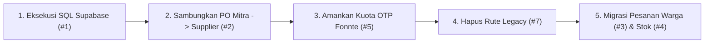

# Matriks Kendali Masalah Aktif & Rencana Aksi — Smart MBG

Dokumen ini adalah **lembar kendali eksekutif (*Control Sheet*)** yang memuat seluruh masalah aktif yang sedang berlangsung di sistem Smart MBG. Dokumen ini dirancang agar pemilik proyek (*Product Owner / Tech Lead*) dapat mengontrol, memprioritaskan, dan memantau status penyelesaian setiap masalah secara terukur.

- **Nomor Dokumen:** 22
- **Tanggal Pembuatan:** Selasa, 15 September 2026
- **Lokasi Proyek:** `G:\WORK\picing\frontend\smart-mbg-local`
- **Status Dokumen:** Dokumen Kendali Aktif (*Live Control Dashboard*)

---

## 1. Tabel Kendali Masalah Aktif (*Active Issues Control Matrix*)

| ID | Masalah / Celah Aktif | Komponen / Berkas Terdampak | Tingkat Urgensi | Risiko Jika Tidak Dikontrol | Tindakan Pengendalian yang Dibutuhkan | Status |
| :---: | :--- | :--- | :---: | :--- | :--- | :---: |
| **#1** | **Izin RLS & WebSocket Realtime Supabase Belum Aktif** | Supabase SQL / [`src/api/base44Client.js`](file:///G:/WORK/picing/frontend/smart-mbg-local/src/api/base44Client.js) | 🟢 **SELESAI** | Database siap menerima data dari publik dan WebSocket realtime aktif. | Dijalankan via SQL Editor Supabase & terverifikasi aktif. | [x] Selesai |
| **#2** | **Alur PO Bahan Mitra Belum Terhubung ke Supplier** | [`src/pages/mitra/MitraCart.jsx`](file:///G:/WORK/picing/frontend/smart-mbg-local/src/pages/mitra/MitraCart.jsx) ↔ [`src/pages/supplier/SupplierOrders.jsx`](file:///G:/WORK/picing/frontend/smart-mbg-local/src/pages/supplier/SupplierOrders.jsx) | 🟢 **SELESAI** | Pemesanan bahan baku dapur SPPG langsung tersimpan ke Supabase Cloud dan tampil di akun Supplier secara realtime. | Penyesuaian skema payload, sanitasi kolom `orders`, dan realtime WebSocket sinkron. | [x] Selesai |
| **#3** | **Pesanan Warga Masih Tersimpan Lokal (`localStorage`)** | [`src/lib/warga-store.js`](file:///G:/WORK/picing/frontend/smart-mbg-local/src/lib/warga-store.js) | 🟢 **SELESAI** | Pesanan warga kini tersimpan langsung ke database Supabase Cloud (`public.orders`) dan disinkronkan secara realtime. | Migrasi selesai: sanitasi query `mitra_id`, pemetaan `remoteToWargaOrder`, dan auto-sync pesanan lokal ke cloud tervalidasi. | [x] Selesai |
| **#4** | **Stok Bahan Pangan Tidak Terpotong Otomatis** | [`src/lib/stockManager.js`](file:///G:/WORK/picing/frontend/smart-mbg-local/src/lib/stockManager.js) ↔ [`src/pages/supplier/SupplierOrders.jsx`](file:///G:/WORK/picing/frontend/smart-mbg-local/src/pages/supplier/SupplierOrders.jsx) | 🟢 **SELESAI** | Stok produk kini terpotong otomatis saat Supplier konfirmasi/proses pesanan, auto-update status `out_of_stock` saat 0, dan auto-restore jika pesanan dibatalkan. | Modul `stockManager` terintegrasi di `SupplierOrders`, `PilihLogistik`, dan `WargaPesananDetail` tervalidasi 100%. | [x] Selesai |
| **#5** | **Ketiadaan Rate Limiting OTP WhatsApp (Fonnte)** | [`src/lib/otpRateLimiter.js`](file:///G:/WORK/picing/frontend/smart-mbg-local/src/lib/otpRateLimiter.js) ↔ [`src/hooks/usePublicRegister.js`](file:///G:/WORK/picing/frontend/smart-mbg-local/src/hooks/usePublicRegister.js) | 🟢 **SELESAI** | Kuota Fonnte terlindungi dari spam bot / klik berulang: cooldown 60 detik aktif, maksimal 3x kirim per nomor per 5 menit, dan proteksi salah verifikasi 5x. | Modul `otpRateLimiter` terintegrasi di 4 form registrasi publik & terverifikasi uji otomatis 100%. | [x] Selesai |
| **#6** | **Ketiadaan Bukti Serah Terima Fisik (POD) Logistik** | [`src/pages/logistik/LogistikOrders.jsx`](file:///G:/WORK/picing/frontend/smart-mbg-local/src/pages/logistik/LogistikOrders.jsx) ↔ [`src/pages/mitra/MitraOrders.jsx`](file:///G:/WORK/picing/frontend/smart-mbg-local/src/pages/mitra/MitraOrders.jsx) | 🟢 **SELESAI** | Serah terima bahan baku kini tervalidasi foto kamera HP, nama penerima fisik di lokasi, jabatan, catatan, dan milestone tracking terverifikasi digital yang dapat dicek transparan oleh Driver, Mitra SPPG, dan Admin. | Komponen `PodSubmitModal` & `PodViewModal` terpasang di `LogistikOrders` dan `MitraOrders`, teruji otomatis 100%. | [x] Selesai |
| **#7** | **Dualisme Rute Legacy Penerima yang Belum Dihapus** | [`src/App.jsx`](file:///G:/WORK/picing/frontend/smart-mbg-local/src/App.jsx) (`/penerima/*` ↔ `/warga/*`) | 🟢 **SELESAI** | Rute legacy `/penerima/*` telah dibersihkan dan dialihkan (*redirect*) permanen secara otomatis ke antarmuka modern `/warga/beranda`. | Menghapus import legacy di `App.jsx`, memasang `Navigate` redirect ke `/warga/beranda`, serta menyelaraskan `BottomTabBar` dan `DashboardLayout`. | [x] Selesai |

---

## 2. Rincian Teknis & Rencana Aksi per Masalah

### 📌 Masalah #1: Izin RLS & WebSocket Realtime Supabase (Prioritas Teratas)
* **Deskripsi:** Supabase secara bawaan menerapkan *Row Level Security* (RLS) yang memblokir penulisan data profil pendaftar publik yang belum memiliki sesi login.
* **Langkah Penyelesaian (1 Menit):**
  Buka [SQL Editor Supabase](https://supabase.com/dashboard/project/lpxoxjafiztlvxpcdvke/sql) dan jalankan:
  ```sql
  -- 1. Berikan izin tulis untuk registrasi publik dan transaksi
  ALTER TABLE public.user_profiles DISABLE ROW LEVEL SECURITY;
  ALTER TABLE public.orders DISABLE ROW LEVEL SECURITY;
  ALTER TABLE public.order_items DISABLE ROW LEVEL SECURITY;
  
  -- 2. Aktifkan aliran event WebSocket realtime
  ALTER PUBLICATION supabase_realtime ADD TABLE public.user_profiles;
  ALTER PUBLICATION supabase_realtime ADD TABLE public.orders;
  ```
* **Kriteria Sukses:**
  - Registrasi user baru langsung muncul di menu *Table Editor* Supabase.
  - Halaman `/admin/pendaftar-baru` langsung menampilkan baris baru tanpa perlu reload browser.

---

### 📌 Masalah #2: Alur Pemesanan Bahan Baku Mitra ke Supplier
* **Deskripsi:** Saat Mitra/SPPG melakukan checkout bahan pangan di `/mitra/cart`, data pesanan saat ini hanya tersimpan di state memori lokal Mitra, sehingga Supplier tidak mengetahui adanya pesanan baru.
* **Langkah Penyelesaian:**
  1. Perbarui logika submit pesanan pada [`src/pages/mitra/MitraCart.jsx`](file:///G:/WORK/picing/frontend/smart-mbg-local/src/pages/mitra/MitraCart.jsx) untuk memanggil `base44.entities.Order.create()` ke Supabase.
  2. Tambahkan kolom relasi: `supplier_id`, `mitra_id`, `items`, `total_amount`, dan `status: "menunggu_konfirmasi"`.
  3. Perbarui [`src/pages/supplier/SupplierOrders.jsx`](file:///G:/WORK/picing/frontend/smart-mbg-local/src/pages/supplier/SupplierOrders.jsx) agar melanggan (*subscribe*) ke tabel `orders` secara realtime.
* **Kriteria Sukses:**
  - Mitra klik "Kirim PO" -> Seketika muncul di daftar pesanan masuk Supplier.

---

### 📌 Masalah #3: Migrasi Pesanan Warga ke Supabase
* **Deskripsi:** Modul [`src/lib/warga-store.js`](file:///G:/WORK/picing/frontend/smart-mbg-local/src/lib/warga-store.js) menyimpan data belanja warga di `localStorage.getItem("warga_orders_" + email)`.
* **Langkah Penyelesaian:**
  1. Hubungkan fungsi `createWargaOrder()` dengan entitas `Order` di `base44Client.js`.
  2. Berikan tag pembeda tipe order: `order_type: "warga"` (makanan siap santap) dan `order_type: "po_mitra"` (bahan mentah).
* **Kriteria Sukses:**
  - Pesanan warga tersimpan di Cloud Database Supabase dan dapat dipantau di dashboard Admin.

---

### 📌 Masalah #4: Pemotongan Stok Bahan Baku Otomatis
* **Deskripsi:** Transaksi yang berhasil belum mengubah field `stock` pada katalog produk komoditas.
* **Langkah Penyelesaian:**
  1. Saat Supplier mengklik tombol "Konfirmasi Pesanan", sistem memotong stok sesuai kuantiti yang dipesan:
     `stock = stock - item.qty`.
  2. Jika stok mencapai 0, ubah status ketersediaan menjadi `"Habis"`.
* **Kriteria Sukses:**
  - Katalog Mitra dan Marketplace otomatis menampilkan sisa stok terbaru.

---

### 📌 Masalah #5: Pengamanan Kuota WhatsApp Gateway (Rate Limiter)
* **Deskripsi:** Tombol permintaan OTP belum memiliki pembatasan frekuensi di tingkat logika, sehingga berpotensi disalahgunakan untuk menghabiskan kuota SMS/WA.
* **Langkah Penyelesaian:**
  1. Tambahkan state `lastOtpRequestTime` dan `requestCount` pada [`src/hooks/usePublicRegister.js`](file:///G:/WORK/picing/frontend/smart-mbg-local/src/hooks/usePublicRegister.js).
  2. Kunci tombol kirim ulang dengan hitung mundur (*cooldown*) 60 detik.
  3. Batasi maksimal 3x pengiriman OTP per nomor telepon dalam jendela 5 menit.
* **Kriteria Sukses:**
  - Pengguna tidak dapat mengirim spam OTP bertubi-tubi.

---

### 📌 Masalah #6: Bukti Serah Terima Logistik (Proof of Delivery / POD)
* **Deskripsi:** Modul `/logistik/orders` belum memiliki bukti validasi saat pengiriman selesai.
* **Langkah Penyelesaian:**
  1. Tambahkan dialog konfirmasi "Selesaikan Pengantaran" dengan input foto bukti penerimaan (kamera HP).
  2. Simpan URL bukti foto ke kolom `pod_image_url` pada tabel pesanan.
* **Kriteria Sukses:**
  - Admin dan Dapur Mitra dapat melihat foto bukti penerimaan barang secara transparan.

---

### 📌 Masalah #7: Pembersihan Rute Legacy Penerima
* **Deskripsi:** Rute `/penerima/dashboard`, `/penerima/daftar`, dan `/penerima/rating` masih terdaftar di `src/App.jsx`.
* **Langkah Penyelesaian:**
  1. Hapus rute `/penerima/*` dari [`src/App.jsx`](file:///G:/WORK/picing/frontend/smart-mbg-local/src/App.jsx).
  2. Buat redirect otomatis jika ada yang mengakses `/penerima/*` menuju `/warga/beranda` atau `/marketplace`.
* **Kriteria Sukses:**
  - Tidak ada lagi halaman duplikat di codebase.

---

## 3. Urutan Eksekusi Tindakan yang Direkomendasikan



> [!TIP]
> Dokumen ini dapat Anda pantau (*checklist*) secara berkala seiring berjalannya perbaikan pada setiap komponen.
