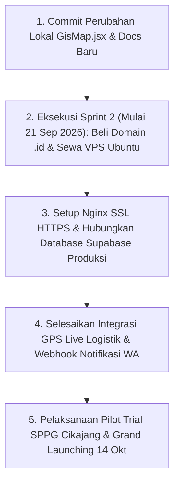

# Daftar Pekerjaan yang Belum Selesai & Roadmap Sisa — Smart MBG Garut

Dokumen ini memuat rangkuman komprehensif mengenai **seluruh pekerjaan, celah fungsional, infrastruktur cloud, dan operasional lapangan yang belum selesai** pada proyek Smart MBG Kabupaten Garut menjelang target *Grand Launching* tanggal **14 Oktober 2026**.

- **Nomor Dokumen:** 23
- **Tanggal Pembuatan:** Jumat, 18 September 2026
- **Lokasi Proyek:** `G:\WORK\picing\frontend\smart-mbg-local`
- **Target Grand Launching:** Rabu, 14 Oktober 2026
- **Status Dokumen:** Master Backlog & Lembar Kendali Sisa Pekerjaan

---

## 1. Ringkasan Eksekutif Kesiapan Sistem

Per tanggal **18 September 2026**, fondasi lokal aplikasi (Sprint 1) dan beberapa fitur krusial rantai pasok telah berhasil dirampungkan dengan hasil pengujian build produksi (`npm run build`) **sukses 100% tanpa error**:
- Formulir pendaftaran 4 peran (Warga, Mitra, Supplier, Logistik) dengan validasi NIK 16 digit dan OTP WhatsApp via Fonnte.
- Keamanan autentikasi 3-layer, proteksi rute RBAC, dan pencegahan bypass login.
- Manajemen pendaftar baru dan live data di Admin Dashboard.
- Alur pemesanan bahan baku SPPG ke Supplier via Supabase Cloud Realtime.
- Pemotongan stok otomatis komoditas pangan saat Supplier konfirmasi pesanan.
- Bukti serah terima fisik (Proof of Delivery / POD) dengan foto kamera HP di modul Logistik.
- Integrasi peta geospasial (GIS) resmi Disperindag Garut mencakup 446 Dapur SPPG dan 1.611 sasaran sekolah di 36 kecamatan.

Meskipun fondasi inti telah siap, masih terdapat **celah fungsional (feature gaps)**, **kebutuhan infrastruktur cloud**, **pengujian keamanan**, dan **tahapan operasional lapangan** yang wajib diselesaikan sebelum rilis publik.

---

## 2. Celah Fungsional & Fitur Aplikasi yang Belum Selesai

Berikut adalah rincian fungsional di tingkat kode aplikasi yang saat ini masih berstatus *mockup*, simulasi, atau belum terintegrasi secara riil:

| No | Modul / Komponen | Hal yang Belum Selesai | Dampak / Risiko | Rencana Solusi & Tindak Lanjut |
| :---: | :--- | :--- | :--- | :--- |
| **1** | **Payment Gateway Riil** `src/pages/warga/Checkout.jsx` `src/pages/mitra/MitraCheckout.jsx` | Pembayaran QRIS, Transfer Bank, dan COD masih berupa **simulasi frontend instan**. | Tidak ada rekonsiliasi dana otomatis saat warga belanja atau mitra melunasi PO bahan pangan. | Integrasikan Payment Gateway riil (Midtrans / Xendit API) untuk pembuatan dynamic QRIS dan callback mutasi otomatis. |
| **2** | **Live GPS Tracking Logistik** `src/pages/logistik/LogistikMap.jsx` | Peta rute kurir masih menggunakan **marker statis/simulasi**. | Admin, Dapur SPPG, dan Sekolah belum bisa memantau posisi fisik kurir secara *real-time* di jalan raya Garut. | Pasang modul WebSocket Geolocation API pada browser kurir untuk streaming koordinat lintang/bujur secara berkala. |
| **3** | **Notifikasi Otomatis Webhook WA** `src/pages/logistik/LogistikOrders.jsx` `src/pages/admin/AdminPendaftarBaru.jsx` | Perubahan status operasional **belum memicu pengiriman pesan WhatsApp otomatis**. | Pengguna harus mengecek web manual untuk tahu apakah barang sudah jalan atau pendaftaran akunnya disetujui. | Tambahkan trigger webhook Fonnte API saat: 1) Driver ubah status ke "Dalam Perjalanan" / "Tiba", 2) Admin setujui akun pendaftar baru. |
| **4** | **Validasi NIK Terpadu Dukcapil** `src/hooks/usePublicRegister.js` | Validasi NIK warga pendaftar baru sebatas **pengecekan format 16 digit angka**. | Berpotensi masuk NIK palsu atau warga dari luar Garut yang bukan sasaran resmi penerima MBG. | Hubungkan dengan API verifikasi Disdukcapil Garut atau pencocokan silang dengan database master penerima manfaat BGN. |
| **5** | **Penyimpanan Chat Persisten** `src/pages/supplier/SupplierChat.jsx` | Percakapan Supplier dengan Admin masih menggunakan **React local state**. | Riwayat obrolan hilang seketika saat browser di-refresh. | Buat tabel `public.chat_messages` di Supabase dan hubungkan `SupplierChat.jsx` ke Supabase Realtime Channels. |
| **6** | **Pencairan Saldo (Disbursement)** `src/pages/supplier/SupplierIncome.jsx` | Modul penarikan omzet supplier masih berupa **visualisasi angka (mockup)**. | Supplier tidak dapat mengajukan transfer hasil penjualan ke rekening bank mereka secara otomatis. | Tambahkan integrasi Disbursement API (Xendit Payout / Midtrans Iris) atau alur persetujuan transfer manual oleh Admin. |
| **7** | **Integrasi Live SIHARBATING** `src/pages/admin/AdminBapokting.jsx` | 🟢 **SELESAI (19 Sep 2026)** | Data pasar riil Garut (80 komoditas Bapokting) kini ditarik live langsung dari server Disperindag Garut via `scripts/mister_mbg_sync_service.mjs`. | Terselesaikan via Dokumen 24: otentikasi login `kadisperindag` aktif dan data tersimpan di `src/data/mister_mbg_live_synced.json`. |
| **8** | **Kalkulator Gizi & Stok Terpadu** `src/pages/mitra/NutritionCalculator.jsx` | Formula perhitungan gizi masih statis di frontend dan belum terhubung stok live. | Menu yang dirancang SPPG bisa saja bahannya sedang habis di supplier lokal pada hari tersebut. | Hubungkan modul kalkulator gizi dengan query ketersediaan stok riil supplier dan kuota AKG nasional. |

---

## 3. Roadmap Infrastruktur & DevOps — SPRINT 2 (21 – 25 September 2026)

Sprint 2 berfokus penuh pada **penyediaan infrastruktur produksi mandiri** di luar localhost. Seluruh tiket ini belum dikerjakan:

| Kode Tiket | Item Pekerjaan | Target Selesai | PIC / Role | Keterangan & Kebutuhan Teknis |
| :--- | :--- | :---: | :--- | :--- |
| **SMBG-10** | **Pengadaan Domain Resmi `.id` & DNS** | 23 Sep 2026 | Project Manager / DevOps | • Pembelian domain resmi `smartmbg.id` via registrar PANDI. • Konfigurasi Cloudflare DNS Management (SSL Full/Strict). |
| **SMBG-14** | **Nomor WhatsApp Gateway Resmi** | 23 Sep 2026 | Product Owner / Backend | • Pendaftaran SIM card khusus WhatsApp Business instansi. • Integrasi nomor resmi ke gateway Fonnte agar aktif 24 jam nonstop. |
| **SMBG-11** | **Provisioning Server Cloud VPS Ubuntu 24.04** | 23 Sep 2026 | DevOps Engineer | • Sewa VPS spesifikasi 4 vCPU, 8 GB RAM, SSD NVMe. • Server hardening: SSH Key authentication, nonaktifkan root login, UFW Firewall (port 22, 80, 443). |
| **SMBG-12** | **Nginx Reverse Proxy & SSL HTTPS** | 24 Sep 2026 | DevOps Engineer | • Pemasangan Nginx web server sebagai reverse proxy. • Sertifikat SSL TLS Let's Encrypt auto-renew (Grade A HTTPS). |
| **SMBG-13** | **Setup Supabase Cloud Produksi & Auto-Backup** | 25 Sep 2026 | Database Engineer | • Inisialisasi instance Supabase Cloud khusus produksi. • Konfigurasi cron daily backup (`pg_dump`) setiap tengah malam ke storage terpisah. |
| **SMBG-15** | **Pipeline CI/CD GitHub Actions** | 25 Sep 2026 | DevOps Engineer | • Pembuatan workflow `.github/workflows/deploy.yml`. • Otomasi build & rsync deploy ke VPS setiap ada push di branch `main`. |

---

## 4. Pengujian Lanjutan & Keamanan — SPRINT 3 (28 Sep – 02 Okt 2026)

Sebagian fitur fungsional Sprint 3 sudah dicicil lebih awal (PO bahan, stok otomatis, POD serah terima). Pekerjaan yang tersisa di Sprint 3 meliputi:

| Kode Tiket | Item Pekerjaan | Target Selesai | PIC / Role | Keterangan & Kebutuhan Teknis |
| :--- | :--- | :---: | :--- | :--- |
| **SMBG-17** | **Pelacakan Live Armada Logistik** | 01 Okt 2026 | Fullstack Dev | Implementasi Web Geolocation kurir & live update marker di Leaflet Map. |
| **SMBG-19** | **Audit Keamanan OWASP & Privasi NIK** | 02 Okt 2026 | Security Analyst | • Uji penetrasi form web (SQL Injection, XSS, CSRF). • Masking NIK (contoh: `3205**********01`) pada respons API publik & verifikasi RLS. |
| **SMBG-20** | **Internal UAT Lintas HP Android & iOS** | 02 Okt 2026 | QA Tester | Pengujian tata letak responsif, keyboard virtual, dan kamera POD pada berbagai seri HP Android (Chrome) dan iPhone (Safari). |

---

## 5. Operasional Lapangan & Peluncuran — SPRINT 4 (05 – 14 Okt 2026)

Fase penutupan yang menentukan keberhasilan operasional sistem di lapangan:

| Kode Tiket | Item Pekerjaan | Target Selesai | PIC / Role | Deliverables Utama |
| :--- | :--- | :---: | :--- | :--- |
| **SMBG-21** | **Pilot Trial Lapangan SPPG Cikajang** | 08 Okt 2026 | Project Manager | Simulasi transaksi riil oleh 1 Dapur SPPG dan 1 Supplier pangan lokal di Garut untuk menguji kesiapan operasional. |
| **SMBG-22** | **Buku Panduan Pengguna (User Manual PDF)** | 09 Okt 2026 | Technical Writer | Modul panduan bergambar langkah-demi-langkah siap unduh untuk 4 peran (Mitra, Supplier, Logistik, Warga). |
| **SMBG-23** | **Pelatihan Operator BGN & Pemkab Garut** | 09 Okt 2026 | Project Manager | Workshop daring/luring, demo dasbor pengawasan, dan serah terima akun superadmin ke dinas terkait. |
| **SMBG-24** | **Optimasi Caching & Skor Lighthouse > 90** | 09 Okt 2026 | Frontend Dev | • Code-splitting bundel Vite (memecah file `index-*.js` dari 3 MB menjadi pecahan vendor). • Kompresi WebP gambar dan aktivasi kompresi Gzip/Brotli. |
| **SMBG-25** | **Code Freeze & Snapshot Backup VPS** | 13 Okt 2026 | DevOps Lead | Pembekuan repositori kode 48 jam sebelum launching dan pembuatan full snapshot image server VPS & database. |
| **SMBG-26** | 🚀 **GRAND LAUNCHING SMART MBG GARUT** | **14 Okt 2026** | **All Team** | Pelepasan domain publik resmi, siaran pers, pembukaan pendaftaran massal, dan monitoring live traffic 24 jam. |

---

## 6. Status Kode & Repositori Lokal Saat Ini

1. **Uncommitted Changes:**
   - File [`src/components/marketplace/GisMap.jsx`](file:///G:/WORK/picing/frontend/smart-mbg-local/src/components/marketplace/GisMap.jsx) memiliki perubahan perapian antarmuka GIS (pembersihan modal redundan dan optimasi rendering peta) yang sudah diverifikasi `npm run build` sukses 22 detik.
2. **Dokumentasi Baru:**
   - [`docs/LAPORAN_PENGEMBANGAN_GIS_MBG_2026_09_16.md`](file:///G:/WORK/picing/frontend/smart-mbg-local/docs/LAPORAN_PENGEMBANGAN_GIS_MBG_2026_09_16.md) (Laporan integrasi 446 SPPG dan 1.611 sasaran).
   - [`docs/23-daftar-pekerjaan-belum-selesai-dan-roadmap-sisa.md`](file:///G:/WORK/picing/frontend/smart-mbg-local/docs/23-daftar-pekerjaan-belum-selesai-dan-roadmap-sisa.md) (Dokumen ini).
3. **Koneksi Remote Git:**
   - Repositori lokal saat ini berdiri sendiri (*standalone* tanpa remote origin) demi keamanan data lokal sesuai instruksi sebelumnya.

---

## 7. Rekomendasi Langkah Eksekusi Terdekat

