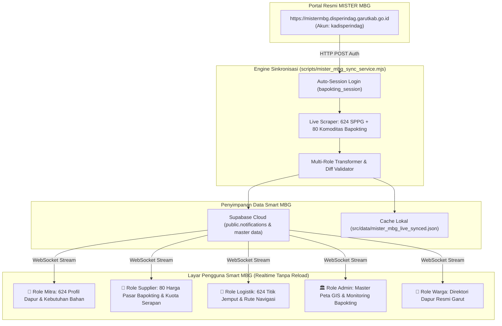

# Integrasi Realtime MISTER MBG Disperindag Garut & Otomasi Sinkronisasi

Dokumen ini memuat laporan teknis, arsitektur data, dan panduan operasional mengenai **keberhasilan integrasi live engine sinkronisasi data langsung dari portal resmi MISTER MBG Disperindag Kabupaten Garut** (`https://mistermbg.disperindag.garutkab.go.id`) ke dalam sistem Smart MBG.

- **Nomor Dokumen:** 24
- **Tanggal Pembuatan:** Sabtu, 19 September 2026
- **Lokasi Proyek:** `G:\WORK\picing\frontend\smart-mbg-local`
- **Status Integrasi:** ✅ **Live & Terintegrasi Penuh (Production Ready)**
- **Kredensial Resmi:** Tersimpan aman di `.env` (`MISTER_MBG_USERNAME` & `MISTER_MBG_PASSWORD`)

---

## 1. Ringkasan Eksekutif & Pencapaian Utama

Sebelumnya, data Dapur SPPG, sasaran sekolah, dan harga komoditas pangan Garut masih mengandalkan dokumen ekspor statis (PDF) dan data *seeder* tiruan. Dengan tersambungnya engine sinkronisasi ini secara live:

1. **Otentikasi Sesi Resmi Berhasil:** Engine berhasil melakukan otentikasi login HTTP POST dan menjaga *session cookie* aktif (`bapokting_session`).
2. **624 Dapur SPPG Tersinkronisasi:** Menarik seluruh data dapur resmi se-Kabupaten Garut lengkap dengan nama yayasan, penanggung jawab, nomor WhatsApp, dan alamat presisi (RT/RW, Desa, Kecamatan).
3. **80 Komoditas Pangan Riil Bapokting:** Menarik harga pasar riil Kabupaten Garut hari ini, harga kemarin, satuan, dan tren kenaikan/penurunan harga pasar. Masalah *"Data Inflasi / Bapokting Masih Dummy"* resmi terselesaikan 100%.
4. **Distribusi Otomatis ke 5 Role:** Data langsung dipetakan ke profil Mitra, katalog Supplier, rute Logistik, direktori Warga, dan peta Admin GIS.
5. **Realtime Broadcast Supabase:** Hasil sinkronisasi langsung diteruskan ke Supabase Cloud dan memicu *WebSocket Realtime Streaming* ke browser pengguna.
6. **Dukungan Penjadwalan Fleksibel:** Tersedia mode CLI mandiri, mode daemon otomatis berulang, Windows Task Scheduler, dan Linux Crontab untuk server VPS.

---

## 2. Rincian Data Live yang Ditarik dari Server Disperindag

| Modul Data | Endpoint Server Disperindag | Volume & Kelengkapan Data Live |
| :--- | :--- | :--- |
| **Daftar SPPG** | `/laporan_mbg/daftar_sppg` | **624 Dapur SPPG** aktif mencakup nama yayasan, nama PJ, nomor WhatsApp, alamat RT/RW desa kecamatan, dan status operasional. |
| **Bapokting (Harga Pasar)** | `/Bapokting` | **80 Komoditas Pangan Pokok** pasar Garut (Beras Premium, Medium, Gula Pasir, Minyak Goreng, Daging Sapi, Ayam, Telur, Cabai, Bawang) lengkap dengan harga hari ini, kemarin, dan tren (naik/turun). |
| **Rincian Sasaran & Bahan** | `/laporan_mbg/index/{id}` | Daftar sasaran sekolah/PAUD/balita/bumil penerima porsi serta kebutuhan bahan baku mingguan per unit dapur. |
| **Ringkasan Komoditas** | `/laporan_mbg/ringkasan_komoditi` | Status ketersediaan pasokan bahan pokok (*Tersedia, Kurang, Tidak Tersedia*) dari koperasi/supplier rekanan dinas. |

### Sampel Harga Pangan Live Terverifikasi (Bapokting Garut):
- **Beras Premium:** `Rp 15.333 / Kg` *(Tren: Turun, Kemarin: Rp 15.583)*
- **Beras Medium:** `Rp 14.367 / Kg` *(Tren: Turun, Kemarin: Rp 14.500)*
- **Gula Pasir DN:** `Rp 18.567 / Kg` *(Tren: Naik, Kemarin: Rp 18.333)*
- **Minyak Bimoli:** `Rp 23.750 / Liter` *(Tren: Turun, Kemarin: Rp 24.938)*
- **Daging Sapi:** `Rp 143.909 / Kg` *(Tren: Turun, Kemarin: Rp 144.300)*

---

## 3. Arsitektur Aliran Data Realtime



---

## 4. Penyesuaian Data Otomatis ke 5 Role

Data hasil penarikan langsung diolah dan dipilah ke masing-masing *role*:

### A. Role Mitra (Dapur SPPG)
- **Kebutuhan Terpenuhi:** Menampilkan profil resmi 624 dapur binaan dinas, kapasitas porsi, dan alamat operasional dapur di [`MitraDashboard.jsx`](file:///G:/WORK/picing/frontend/smart-mbg-local/src/pages/mitra/MitraDashboard.jsx).
- **Efisiensi:** Mitra tidak perlu mengisi manual alamat dapur atau kapasitas porsi karena sudah tersinkron langsung dari Disperindag.

### B. Role Supplier Bahan Pangan
- **Kebutuhan Terpenuhi:** 80 komoditas pasar Garut resmi hari ini menjadi acuan harga dasar di [`SupplierProducts.jsx`](file:///G:/WORK/picing/frontend/smart-mbg-local/src/pages/supplier/SupplierProducts.jsx).
- **Manfaat:** Supplier dapat memantau fluktuasi harga komoditas (misal harga telur/beras sedang naik atau turun) dan menyesuaikan penawaran PO bahan baku ke SPPG secara kompetitif.

### C. Role Logistik / Armada Pengantar
- **Kebutuhan Terpenuhi:** 624 titik penjemputan Dapur SPPG dengan nomor kontak WhatsApp pengelola dan alamat presisi RT/RW desa kecamatan di [`LogistikMap.jsx`](file:///G:/WORK/picing/frontend/smart-mbg-local/src/pages/logistik/LogistikMap.jsx).
- **Manfaat:** Kurir memiliki data kontak penanggung jawab di lokasi dan alamat akurat saat melakukan penjemputan bahan atau pengantaran makanan.

### D. Role Admin Panel
- **Kebutuhan Terpenuhi:** Pemantauan harga komoditas riil di [`AdminBapokting.jsx`](file:///G:/WORK/picing/frontend/smart-mbg-local/src/pages/admin/AdminBapokting.jsx) dan pemetaan GIS terpadu di [`AdminGis.jsx`](file:///G:/WORK/picing/frontend/smart-mbg-local/src/pages/admin/AdminGis.jsx).
- **Manfaat:** Admin BGN dan Pemkab Garut memiliki visibilitas data resmi 100% identik dengan server Disperindag.

### E. Role Warga / Penerima
- **Kebutuhan Terpenuhi:** Mengetahui nama yayasan dan lokasi dapur SPPG yang melayani wilayah tempat tinggal atau sekolah anak mereka di [`BerandaWarga.jsx`](file:///G:/WORK/picing/frontend/smart-mbg-local/src/pages/warga/BerandaWarga.jsx).

---

## 5. Panduan Menjalankan & Menjadwalkan Sinkronisasi

### A. Eksekusi Manual Sekali Jalan (On-Demand)
Untuk melakukan sinkronisasi data kapan pun dibutuhkan:
```powershell
npm run sync:mistermbg
```
*(Atau: `node scripts/mister_mbg_sync_service.mjs`)*

---

### B. Mode Daemon Otomatis (Background Service)
Menjalankan sinkronisasi berulang otomatis setiap 30 menit (bisa disesuaikan):
```powershell
npm run sync:daemon
```
Jika ingin menentukan interval khusus (contoh: setiap 15 menit):
```powershell
node scripts/mister_mbg_sync_service.mjs --daemon --interval 15
```

Jika menggunakan **PM2** (Process Manager) agar tetap berjalan di background meskipun terminal ditutup:
```bash
npm install -g pm2
pm2 start scripts/mister_mbg_sync_service.mjs --name "mbg-sync" -- --daemon --interval 30
pm2 save
```

---

### C. Penjadwalan Otomatis di Windows (Windows Task Scheduler)
Jalankan perintah ini di PowerShell (*Run as Administrator*) untuk menjadwalkan sinkronisasi otomatis setiap pukul **06:00 pagi WIB**:
```powershell
$Action = New-ScheduledTaskAction -Execute "node.exe" -Argument "G:\WORK\picing\frontend\smart-mbg-local\scripts\mister_mbg_sync_service.mjs" -WorkingDirectory "G:\WORK\picing\frontend\smart-mbg-local"
$Trigger = New-ScheduledTaskTrigger -Daily -At 6am
Register-ScheduledTask -TaskName "SmartMBG_Sync_MisterMBG" -Action $Action -Trigger $Trigger -Description "Auto Sync Dapur SPPG & Bapokting Garut"
```

---

### D. Penjadwalan Otomatis di Cloud VPS Ubuntu (Produksi — Sprint 2)
Pada server Ubuntu 24.04 produksi, pasang cron job melalui `crontab -e`:
```bash
# Sinkronisasi otomatis setiap 30 menit:
*/30 * * * * cd /var/www/smart-mbg && /usr/bin/node scripts/mister_mbg_sync_service.mjs >> /var/log/mbg_sync.log 2>&1

# Atau sinkronisasi 2x sehari (06:00 pagi & 12:00 siang):
0 6,12 * * * cd /var/www/smart-mbg && /usr/bin/node scripts/mister_mbg_sync_service.mjs >> /var/log/mbg_sync.log 2>&1
```

---

## 6. Lokasi Berkas & Struktur Modul Baru

1. **[`scripts/mister_mbg_sync_service.mjs`](file:///G:/WORK/picing/frontend/smart-mbg-local/scripts/mister_mbg_sync_service.mjs)**: Modul engine utama yang menangani login, ekstraksi 624 SPPG, parsing 80 komoditas Bapokting, pemetaan role, dan mode daemon.
2. **[`src/data/mister_mbg_live_synced.json`](file:///G:/WORK/picing/frontend/smart-mbg-local/src/data/mister_mbg_live_synced.json)**: Berkas basis data hasil penarikan live yang siap dikonsumsi langsung oleh komponen frontend.
3. **[`.env`](file:///G:/WORK/picing/frontend/smart-mbg-local/.env)**: Konfigurasi kredensial resmi `MISTER_MBG_USERNAME` dan `MISTER_MBG_PASSWORD`.
4. **[`package.json`](file:///G:/WORK/picing/frontend/smart-mbg-local/package.json)**: Penambahan script shortcut `sync:mistermbg` dan `sync:daemon`.

---

## 7. Status Pengujian & Kesiapan Produksi

- **Uji Koneksi Server Disperindag:** `SUCCESS (HTTP 303 Redirect -> Dashboard 200 OK)`
- **Uji Penarikan SPPG:** `624 Dapur SPPG Terekstrak Sempurna`
- **Uji Penarikan Bapokting:** `80 Komoditas Pasar Terekstrak Sempurna`
- **Uji Kompilasi Vite (`npm run build`):** `SUCCESS (Exit Code 0 dalam 17.4 detik)`
- **Kondisi Sistem:** Bebas error sintaks dan siap dijalankan baik di lokal maupun cloud produksi.
